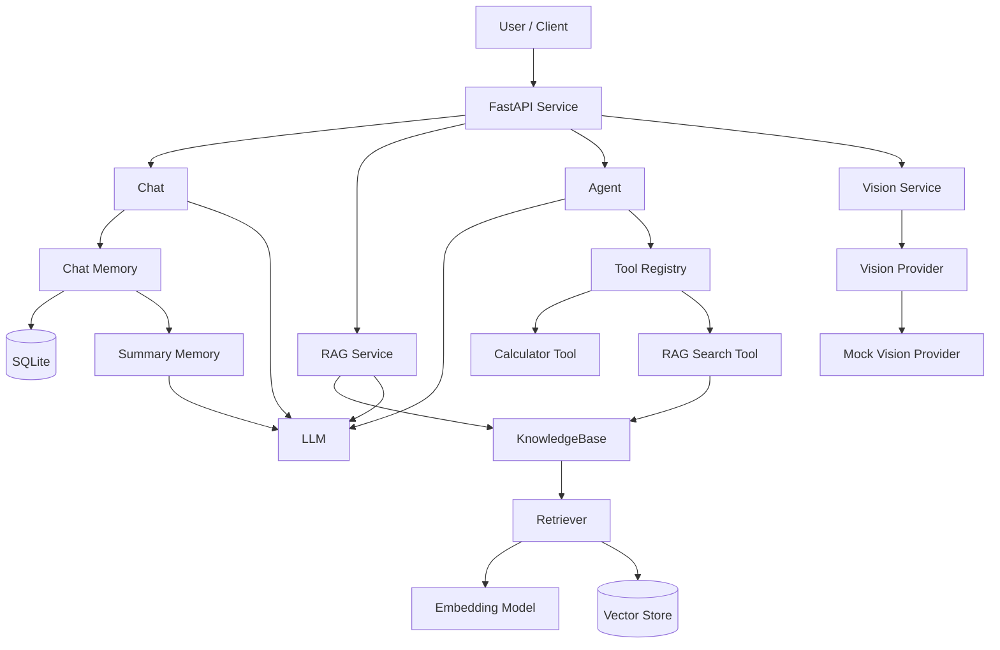

# AI Agent Platform

A modular AI application platform built with Python, integrating conversational memory, RAG, tool calling, multi-tool agents, multimodal capabilities, and FastAPI services.

> 本项目从基础 LLM Chat 逐步演进为一个模块化 AI Agent 应用，完整实现了从模型调用、上下文记忆、RAG 检索增强，到 Tool Calling、Agent、Multimodal、REST API 与 Docker 部署的 AI 应用开发链路。

## Overview

AI Agent Platform 是一个用于学习和实践现代 AI 应用开发的模块化项目。

项目以大语言模型为核心，通过逐步构建 Memory、RAG、Tool Calling、Agent、Multimodal 等能力，将基础聊天程序扩展为可通过 FastAPI 对外提供服务的 AI 应用系统。

项目重点不仅在于调用 LLM API，还包括 AI 应用中的核心工程问题：

- 对话上下文管理与 SQLite 持久化
- Token-aware 上下文窗口控制与自动摘要
- 文档切分、Embedding、Vector Store 与语义检索
- 基于知识库 Context 的 RAG 问答
- LLM Tool Calling 与自动工具选择
- Multi-Tool Agent 执行链路
- 可插拔 Vision Provider 多模态架构
- FastAPI REST API 与 Swagger / OpenAPI
- 异常处理、Retry、Logging 与自动化测试
- Docker 容器化部署

## Features

### AI Chat & Memory

- DeepSeek OpenAI-compatible LLM integration
- Streaming response
- Multi-role system prompts
- Conversation memory
- SQLite persistent storage
- Conversation history recovery
- Token-aware context management
- Automatic conversation summarization
- Summary persistence and recovery

### RAG

- Local document loading
- Configurable text chunking and chunk overlap
- Multilingual text embeddings
- In-memory vector store
- Cosine similarity search
- Top-K semantic retrieval
- Similarity threshold filtering
- RAG prompt construction
- Knowledge-bound answer generation
- Unified `KnowledgeBase` interface

### Agent & Tool Calling

- LLM Tool Calling
- Structured Tool Schema
- Tool Registry
- Tool Executor
- Automatic tool selection
- Calculator Tool
- RAG Search Tool
- Multi-Tool Agent
- Tool result feedback to LLM
- No-tool direct response

### Multimodal

- Image loading and validation
- Base64 / Data URL encoding
- Multimodal message construction
- Pluggable Vision Provider architecture
- Vision Service
- Mock Vision Provider
- FastAPI image upload
- Vision API

> The current Vision module uses a pluggable Provider architecture. The complete multimodal processing pipeline is validated with a Mock Vision Provider, while a real vision model can be integrated through an additional Provider implementation.

### API & Engineering

- FastAPI REST service
- `/chat` API
- `/rag` API
- `/agent` API
- `/vision` API
- `/health` health check
- Pydantic request / response validation
- Global exception handling
- Retry with exponential backoff
- Application logging
- Swagger / OpenAPI documentation

### Testing & Deployment

- Pytest automated testing
- Mock-based LLM testing
- Mock-based RAG testing
- Mock-based Agent testing
- Mock-based Vision testing
- Multi-Tool Agent testing
- API automated testing
- 75 automated tests
- 84% overall test coverage
- Docker containerization
- Runtime environment variable injection
- Containerized FastAPI deployment

## Architecture



The system is organized into several independent layers:

1. **LLM Layer** — provides standard completion, streaming response, and Tool Calling capabilities.
2. **Memory Layer** — manages conversation history, SQLite persistence, token-aware context control, and automatic summarization.
3. **RAG Layer** — handles document processing, embeddings, vector retrieval, context construction, and knowledge-based generation.
4. **Agent Layer** — lets the LLM select and execute registered tools such as Calculator and RAG Search.
5. **Multimodal Layer** — abstracts image understanding through a pluggable Vision Provider interface.
6. **API Layer** — exposes Chat, RAG, Agent, and Vision capabilities through FastAPI.
7. **Engineering Layer** — provides logging, retry, exception handling, automated testing, and Docker deployment.

## Project Structure

```text
ai-agent-platform/
├── config/
│   └── settings.py
│
├── data/
│   ├── images/
│   │   └── test.png
│   └── test.txt
│
├── src/
│   ├── agent/
│   │   ├── __init__.py
│   │   ├── agent.py
│   │   └── executor.py
│   │
│   ├── api/
│   │   ├── __init__.py
│   │   ├── app.py
│   │   ├── routes.py
│   │   └── schemas.py
│   │
│   ├── multimodal/
│   │   ├── __init__.py
│   │   ├── image_loader.py
│   │   ├── message_builder.py
│   │   ├── provider.py
│   │   └── vision.py
│   │
│   ├── rag/
│   │   ├── __init__.py
│   │   ├── document_loader.py
│   │   ├── embeddings.py
│   │   ├── knowledge_base.py
│   │   ├── rag_service.py
│   │   ├── retriever.py
│   │   ├── text_splitter.py
│   │   └── vector_store.py
│   │
│   ├── tools/
│   │   ├── __init__.py
│   │   ├── calculator.py
│   │   ├── rag_tool.py
│   │   └── registry.py
│   │
│   ├── utils/
│   │   └── retry.py
│   │
│   ├── __init__.py
│   ├── database.py
│   ├── exceptions.py
│   ├── llm.py
│   ├── logger.py
│   ├── main.py
│   ├── memory.py
│   ├── prompt.py
│   ├── summary.py
│   └── tokenizer.py
│
├── tests/
│   ├── test_agent.py
│   ├── test_api.py
│   ├── test_api_schemas.py
│   ├── test_calculator.py
│   ├── test_database.py
│   ├── test_document_loader.py
│   ├── test_embeddings.py
│   ├── test_exception.py
│   ├── test_image_loader.py
│   ├── test_knowledge_base.py
│   ├── test_memory.py
│   ├── test_message_builder.py
│   ├── test_multi_tool_agent.py
│   ├── test_multi_tool_agent_mock.py
│   ├── test_multi_tool_calling.py
│   ├── test_rag_pipeline.py
│   ├── test_rag_prompt.py
│   ├── test_rag_service.py
│   ├── test_retriever.py
│   ├── test_retry.py
│   ├── test_summary_memory.py
│   ├── test_text_splitter.py
│   ├── test_tokenizer.py
│   ├── test_tool_executor.py
│   ├── test_tool_registry.py
│   ├── test_vector_store.py
│   └── test_vision.py
│
├── .dockerignore
├── .env.example
├── .gitignore
├── Dockerfile
├── README.md
└── requirements.txt
```

## Core Modules

### LLM Layer

`src/llm.py`

Provides the unified interface for LLM communication, including:

- Standard chat completion
- Streaming completion
- Tool Calling
- Retry and exception integration

The project currently communicates with an OpenAI-compatible LLM API.

### Memory System

`src/memory.py`  
`src/database.py`  
`src/summary.py`  
`src/tokenizer.py`

Provides persistent conversational memory with:

- SQLite message persistence
- Conversation history recovery
- Message history limits
- Token-aware context control
- Automatic history summarization
- Persistent summary memory

When the context exceeds the configured limit, older messages are summarized while recent messages remain available to the LLM.

### RAG System

`src/rag/`

Implements the complete retrieval pipeline:

```text
Document
   ↓
Text Splitter
   ↓
Embedding Model
   ↓
Vector Store
   ↓
Retriever
   ↓
Similarity Filtering
   ↓
Context Construction
   ↓
LLM Generation
```

`KnowledgeBase` provides a unified interface over the complete RAG pipeline.

### Agent System

`src/agent/`  
`src/tools/`

Implements an LLM-driven Multi-Tool Agent:

```text
User Request
     ↓
LLM Tool Selection
     ↓
Tool Registry
     ↓
Tool Executor
     ↓
Tool Result
     ↓
LLM Final Response
```

Currently registered tools include:

- `calculator` — structured mathematical calculation
- `rag_search` — local knowledge base retrieval

If no tool is required, the Agent returns the LLM response directly.

### Multimodal System

`src/multimodal/`

Provides an extensible image-processing architecture:

```text
Image
  ↓
Image Loader
  ↓
Multimodal Message Builder
  ↓
Vision Service
  ↓
Vision Provider
```

The Vision layer uses a Provider abstraction so different vision models can be integrated without changing the upper-level business logic.

The current implementation uses `MockVisionProvider` to validate the complete multimodal pipeline.

### API Layer

`src/api/`

FastAPI exposes the core AI capabilities as REST services:

- `GET /health` — service health check
- `POST /chat` — standard LLM chat
- `POST /rag` — knowledge base question answering
- `POST /agent` — Multi-Tool Agent
- `POST /vision` — image understanding

Pydantic models provide request validation and FastAPI automatically generates Swagger / OpenAPI documentation.

### Engineering Infrastructure

The project also includes:

- Unified application exceptions
- Retry with exponential backoff
- Application logging
- Environment-based configuration
- Pytest automated testing
- Mock-based external dependency isolation
- Test coverage reporting
- Docker containerization

## Quick Start

### 1. Clone the Repository

```bash
git clone <your-repository-url>
cd ai-agent-platform
```

> The repository name will be updated to `ai-agent-platform` in the final release.

### 2. Create a Virtual Environment

```bash
python -m venv .venv
```

Activate the virtual environment.

Windows:

```bash
.venv\Scripts\activate
```

macOS / Linux:

```bash
source .venv/bin/activate
```

### 3. Install Dependencies

```bash
pip install -r requirements.txt
```

The project uses Python 3.12.

### 4. Configure Environment Variables

Copy the example environment file:

```bash
cp .env.example .env
```

On Windows PowerShell:

```powershell
Copy-Item .env.example .env
```

Then configure the required values in `.env`:

```env
API_KEY=your_api_key_here
BASE_URL=your_api_base_url_here
MODEL=your_model_name_here
```

> `.env` contains local configuration and should never be committed to version control.

### 5. Start the FastAPI Service

```bash
uvicorn src.api.app:app --host 0.0.0.0 --port 8000
```

After startup, the service provides:

- Health Check: `/health`
- Swagger UI: `/docs`
- OpenAPI Schema: `/openapi.json`

## API Usage

### Health Check

```http
GET /health
```

Response:

```json
{
  "status": "OK"
}
```

### Chat API

```http
POST /chat
Content-Type: application/json
```

Request:

```json
{
  "message": "What is RAG?"
}
```

Response:

```json
{
  "answer": "..."
}
```

### RAG API

```http
POST /rag
Content-Type: application/json
```

Request:

```json
{
  "question": "What is the purpose of Chunk Overlap?"
}
```

Response:

```json
{
  "answer": "..."
}
```

The RAG endpoint retrieves relevant context from the local knowledge base before generating the final answer.

### Agent API

```http
POST /agent
Content-Type: application/json
```

Request:

```json
{
  "message": "Calculate 128 multiplied by 37."
}
```

The Agent determines whether a registered tool is required. For this request, it can select the `calculator` tool automatically.

Response:

```json
{
  "answer": "128 multiplied by 37 equals 4736."
}
```

The Agent can currently route requests between:

```text
User Request
     ↓
    Agent
   ↙  ↓  ↘
LLM  Calculator  RAG Search
```

### Vision API

```http
POST /vision
Content-Type: multipart/form-data
```

Form fields:

| Field | Type | Description |
| --- | --- | --- |
| `prompt` | string | Instruction for image analysis |
| `image` | file | Image uploaded by the user |

Example:

```text
prompt = "Describe this image."
image  = test.png
```

> The current Vision API uses `MockVisionProvider` to validate the complete image upload and multimodal processing pipeline. A real vision model provider can be integrated through the existing Provider interface.

## Docker Deployment

The application can also be deployed as a Docker container.

### Build the Image

```bash
docker build -t ai-agent-platform .
```

### Run the Container

Pass environment variables at runtime instead of storing sensitive configuration inside the Docker image:

```bash
docker run \
  --name ai-agent-platform \
  -p 8000:8000 \
  --env-file .env \
  ai-agent-platform
```

Windows PowerShell can use the same command on one line:

```powershell
docker run --name ai-agent-platform -p 8000:8000 --env-file .env ai-agent-platform
```

Run in detached mode:

```bash
docker run -d --name ai-agent-platform -p 8000:8000 --env-file .env ai-agent-platform
```

Check running containers:

```bash
docker ps
```

View application logs:

```bash
docker logs ai-agent-platform
```

After the container starts, the FastAPI service is available on port `8000`.

The Docker deployment has been validated against the following endpoints:

- `/health`
- `/chat`
- `/rag`
- `/agent`
- `/vision`

### Docker Security

The `.dockerignore` file excludes local and sensitive runtime files such as:

```text
.env
.venv/
*.db
logs/
.coverage
htmlcov/
```

Sensitive runtime configuration is injected through environment variables and is not embedded in the Docker image.

## Testing & Coverage

The project uses `pytest` for automated testing and `pytest-cov` for coverage analysis.

Run all tests:

```bash
python -m pytest -v
```

Run tests with coverage:

```bash
python -m pytest --cov=src --cov=config --cov-report=term-missing
```

Current test status:

```text
75 tests passed
84% overall coverage
```

The automated test suite covers the major application layers, including:

- Conversation Memory
- SQLite Persistence
- Summary Memory
- Token Estimation
- RAG Pipeline
- Retriever and Vector Store
- KnowledgeBase
- Tool Registry and Tool Executor
- Multi-Tool Agent
- FastAPI endpoints
- Multimodal processing
- Retry and exception handling

External or expensive dependencies are isolated with Mock-based tests where appropriate, while integration tests validate the complete RAG and Agent execution paths.

## Tech Stack

| Category | Technology |
| --- | --- |
| Language | Python 3.12 |
| LLM Integration | OpenAI-compatible API |
| Current LLM Provider | DeepSeek |
| API Framework | FastAPI |
| API Schema | Pydantic |
| ASGI Server | Uvicorn |
| Database | SQLite |
| Embedding | Sentence Transformers |
| Vector Search | NumPy / Cosine Similarity |
| ML Runtime | PyTorch / Transformers |
| Testing | Pytest |
| Coverage | pytest-cov |
| HTTP Client | HTTPX |
| Configuration | python-dotenv |
| Containerization | Docker |
| Version Control | Git / GitHub |

## Development Roadmap

The project was developed incrementally from a basic LLM chat application into a modular AI Agent platform.

| Stage | Development |
| --- | --- |
| Day 0 | Development environment and project initialization |
| Day 1 | Modular Python project structure |
| Day 2 | OpenAI-compatible LLM API integration |
| Day 3 | Conversation memory |
| Day 4 | Streaming response and logging |
| Day 5 | SQLite persistent memory and history recovery |
| Day 6 | Prompt management and multi-role assistants |
| Day 7 | Token estimation and context window control |
| Day 8 | Automatic conversation summarization and summary persistence |
| Day 9 | Exception handling, retry, logging improvements, and automated testing |
| Day 10 | RAG foundation: document loading, text splitting, embeddings, vector store, and semantic retrieval |
| Day 11 | Knowledge base QA: Retriever, RAG Prompt, similarity threshold, KnowledgeBase, and LLM generation |
| Day 12 | Tool Calling and Agent: Tool Registry, Tool Schema, Tool Executor, and Agent Loop |
| Day 13 | FastAPI service layer: Chat, RAG, Agent APIs, Swagger, and API testing |
| Day 14 | Multimodal architecture: image processing, Vision Provider, Vision API, and Mock Vision |
| Day 15 | Engineering integration: Multi-Tool Agent, RAG Tool, API refactoring, test coverage, Docker, and project packaging |

### Evolution

```text
LLM Chat
   ↓
Conversation Memory
   ↓
Persistent & Summary Memory
   ↓
RAG
   ↓
Tool Calling
   ↓
Agent
   ↓
Multi-Tool Agent
   ↓
Multimodal
   ↓
FastAPI Service
   ↓
Testing & Docker
```

This incremental approach keeps each capability independently testable while gradually integrating them into a complete AI application architecture.

## Design Decisions

### 1. Modular Architecture

Chat, Memory, RAG, Agent, Tool, Multimodal, and API capabilities are separated into independent modules instead of being implemented in a single application file.

This reduces coupling and makes individual components easier to test and extend.

### 2. Unified KnowledgeBase Interface

The RAG pipeline is encapsulated behind `KnowledgeBase`:

```text
Document
→ Chunk
→ Embedding
→ Vector Store
→ Retriever
→ RAG Service
```

Upper-level components do not need to manage individual RAG components directly.

### 3. RAG as an Agent Tool

Instead of maintaining Agent and RAG as completely isolated systems, the knowledge base is exposed to the Agent through `rag_search`.

This allows the LLM to choose between:

- Direct Response
- Calculator Tool
- RAG Search Tool

according to the user request.

### 4. Lazy Initialization

Heavy services such as the knowledge base are initialized only when required and reused afterward.

This prevents application startup from unnecessarily loading embedding models and building the vector store before a RAG request is made.

### 5. Pluggable Vision Provider

The multimodal layer depends on a `VisionProvider` abstraction rather than a specific vision model.

```
Vision Service
      ↓
Vision Provider
      ↓
Model Implementation
```

The current project uses `MockVisionProvider` for complete pipeline validation while keeping the architecture ready for a real vision provider.

### 6. Environment-based Configuration

Runtime configuration is loaded from environment variables rather than hard-coded into the source code.

`.env.example` documents the required configuration while local `.env` files remain outside version control and Docker build context.

### 7. Mock + Integration Testing

Mock tests isolate external dependencies such as LLM calls, while integration tests validate complete execution paths such as RAG retrieval and Multi-Tool Agent execution.

This keeps the test suite stable while still validating real component integration.

### 8. Containerized Deployment

Docker packages the application and its runtime dependencies into a reproducible environment.

Runtime configuration is injected when the container starts instead of being embedded into the image.

## Author

**bing-eloise**
